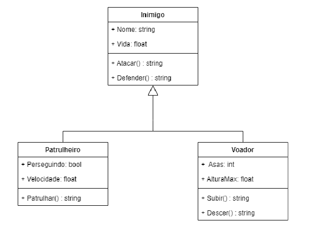
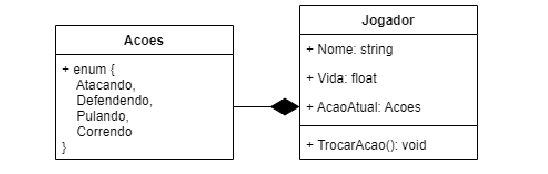
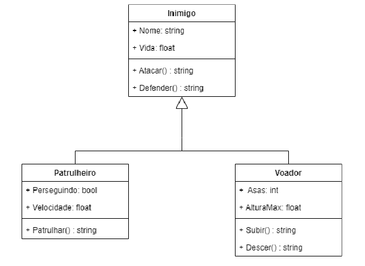

# Exercícios: Orientação a Objetos

**1 -** Crie um projeto com a estrutura de classes mostrada no diagrama abaixo:

---

Implemente ações que retornam textos simulando a ação e instancie na classe principal do projeto as classes filhas e todos os métodos implementados.

Defina valores para todos os atributos das 3 classes, em cada instância criada.

**2 –** Seguindo o mesmo diagrama do exercício 1 encapsule o atributo “vida”, tornando-o

privado, e manipulando-o apenas dentro do método “Defender”, estipulando como 100 seu

valor inicial, e decrementando -5 a cada defesa realizada. Chame o método alterado na classe

principal do seu programa para testá-lo.

**3 –** Seguindo o diagrama do exercício 1 crie uma sobrescrita do método “Atacar” para a classe

Voador, aumente sua altura máxima em +15, mostrando a seguinte string de retorno: “O

inimigo aéreo atacou com sucesso, agora ele pode voar mais alto”. Chame os métodos em

suas duas formas na classe principal do seu programa.

**4 –** Seguindo o diagrama do exercício 1 crie um método construtor para a classe “Patrulheiro”

que obrigue ser passado o atributo “Velocidade” em sua instanciação.

**5 –** Crie uma classe estática chamada Calculadora, com as quatro operações básicas (Somar,

Subtrair, Dividir e Multiplicar), onde cada método recebe um array de tamanho indefinido de

números decimais(float), realizando suas devidas operações na implementação de cada

método. Chame cada uma das operações na classe principal do seu programa.

**6 –** Crie uma classe chamada Jogador, utilizando uma máquina de estados(enum), conforme

diagrama abaixo:

Altere os estados do jogador no método “TrocarAcao” quando o usuário apertar no teclado as seguintes teclas:

- W = Pulando
- A = Correndo
- D = Defendendo
- S = Atacando

Instancie a classe Jogador no método principal do seu programa e mostre no console a ação atual do jogador, enquanto captura as teclas digitadas.

**7 –** Seguindo o mesmo diagrama do exercício 6, crie uma interface para o Jogador, mantendo

o método “TrocarAcao” e adicionando o método “Morrer”, que retorna uma string.

Implemente a interface na classe jogador atribuindo o valor de sua vida para 0, e acrescente

no retorno do método Morrer a seguinte frase “Game Over”.

**8 –** Seguindo o mesmo diagrama do exercício 6 crie um método construtor para “Jogador”,

obrigando ser passado o atributo “Nome” em suas instâncias. Chame essa nova forma de

instância na classe principal do seu programa.

**9 –** Seguindo o mesmo diagrama do exercício 6 crie uma sobrecarga do método construtor

para “Jogador”, obrigando a ser passado também o atributo “Vida”. Chame cada uma das

opções de instância na classe principal do seu programa.

**10 –** Crie uma Lista de Jogadores, incluindo ao menos 3 jogadores nela. Mostre no console o

nome dos 3 jogadores presentes na Lista, lendo-a através de um laço.

**1 –** Crie um projeto com a estrutura de classes mostrada no diagrama abaixo:

Implemente ações que retornam textos simulando a ação e instancie na classe principal do projeto as classes filhas e todos os métodos implementados.

Defina valores para todos os atributos das 3 classes, em cada instância criada.

**3 –** Seguindo o diagrama do exercício 1 crie uma sobrescrita do método “Atacar” para a classe

Voador, aumente sua altura máxima em +15, mostrando a seguinte string de retorno: “O

inimigo aéreo atacou com sucesso, agora ele pode voar mais alto”. Chame os métodos em

suas duas formas na classe principal do seu programa.